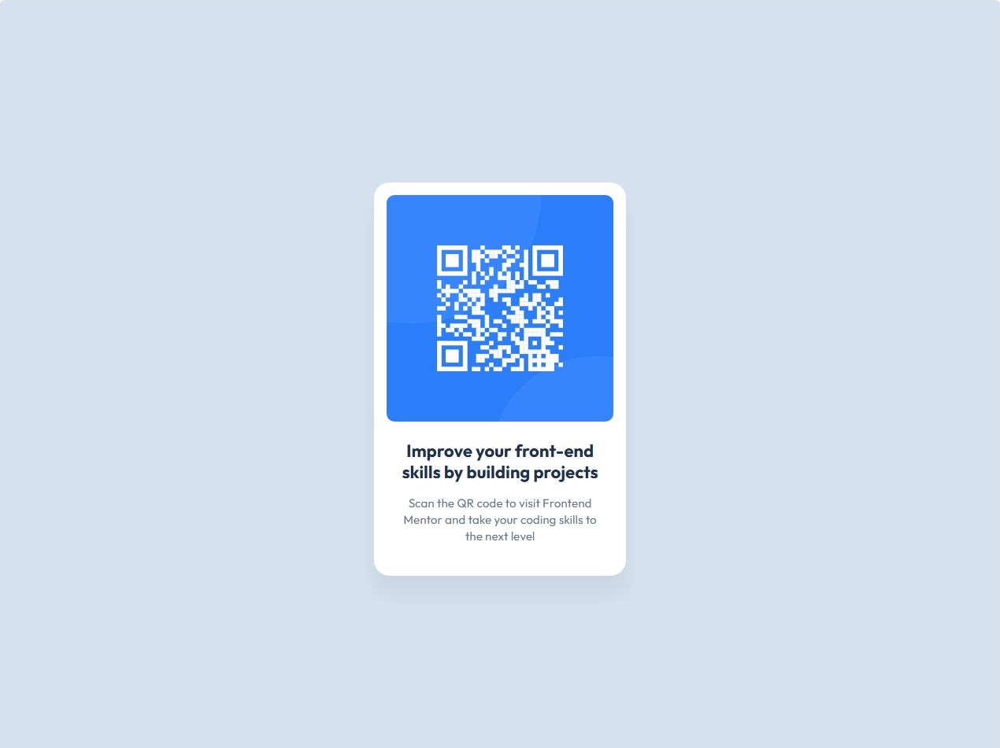

# QR Code Component


[](https://qr-code-component-liart-three.vercel.app/)

> This is a solution to the "QR Code Component" challenge on [Frontend Mentor](https://www.frontendmentor.io/). The goal was to build a component that is visually as close as possible to the proposed design, practicing fundamental HTML and CSS skills.

<br>

**🚀 [View Live Demo](https://qr-code-component-liart-three.vercel.app/)**

<br>

### 🖥️ Screenshot



---

### 📋 Table of Contents

* [The Challenge](#-the-challenge)
* [Tech Stack](#-tech-stack)
* [What I Learned](#-what-i-learned)
* [How to View](#-how-to-view)
* [Author](#-author)

---

### 🚀 The Challenge

The challenge was to create a QR code card component and make it look as close to the provided design as possible. This involved:
* Structuring the content with semantic HTML.
* Using CSS to style the layout, colors, and typography.
* Ensuring the component is centered on the page.

---

### 🛠️ Tech Stack

The following tools and technologies were used in the construction of this project:

* **HTML5:** For structure and content semantics.
* **CSS3:** For styling, layout, and design.
    * **CSS Custom Properties (Variables):** To keep a cleaner and more reusable code for colors and spacing.
    * **Grid Layout:** To efficiently center the main component on the screen.

---

### 📖 What I Learned

As a front-end beginner, this project was a great opportunity to practice and solidify important concepts:

* **Semantic HTML Structure:** I used the `<main>` tag for the main content, which helps with accessibility and organization.
* **Using CSS Variables (`:root`):** I learned to centralize all my colors, fonts, and spacing in one place. This makes code maintenance much easier.
* **Centering Elements:** I practiced using `display: grid` and `place-items: center` on the `body` to center the card in a simple and robust way.
* **Box Model and `box-sizing`:** I deepened my understanding of how `padding`, `margin`, and `border-box` work together to create precise layouts.
* **Basic Responsive Design:** I used `max-width` to ensure the card doesn't get too large on bigger screens, maintaining a pleasant look.

---

### 📂 How to View

You can view the final result online or, if you prefer, clone the repository to explore the code on your machine.

**Option 1: Live Demo (Recommended)**

The easiest way to see the project in action is by accessing the deploy link:

👉 **[Access the live demo](https://qr-code-component-liart-three.vercel.app/)**

---

**Option 2: Running Locally**

If you want to explore the source code, follow these steps:

```bash
# 1. Clone this repository (change 'your-user' and 'repository-name')
git clone [https://github.com/your-user/repository-name.git](https://github.com/WhatsIgorDoing/qr-code-component.gitt)

# 2. Navigate to the project folder
cd repository-name

# 3. Open the index.html file in your browser
```

---

### 👨‍💻 Author

Project developed by **Igor Bueno**.

[](https://www.linkedin.com/in/engigorbueno/)
[](https://github.com/WhatsIgorDoing)